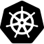
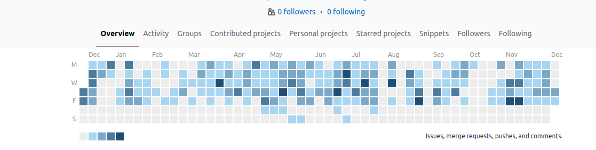

### Ciao, nice to meet you 👋

I'm Simone, a Computer Engineer currently working as Machine Learning Engineer [@Generali Italia](https://www.generali.it).   
I like to interpret graphs, build stuff from scratch, and dream big.

### 🎓 Education
* Master of Science in Computer Science and Engineering at Politecnico di Milano focusing in **Machine Learning**, Data Science, **Software Engineering**. Final Grade 108/110.
* Bachelor of Science in Computer Science at Università di Genova focusing on **Software Engineering** and theoretical computer science. Final Grade 105/110.

### 👨🏽‍💻 Working Experience
* **Generali Italia** | Machine Learning Engineer, January 2022 - present

* **Mia-Platform** | Software Engineer, May 2020 - December 2021
  * Developed and administered 100+ Apache Kafka pipelines to enhance data ingestion into a Data Lake.
  * Reduced Data Lake aggregation time by 50% by redesigning and implementing new MongoDB aggregation pipelines projected for exceptional performance.
  * Implemented 30+ micro-services, using mostly JavaScript, based on general and specific client requirements to expand Mia-Platform marketplace (PaaS).

* **Boston University SecLab** | Research Assistant, January-March 2020
  * Collected and conducted preliminary processing of over 1M social media posts from Twitter, Reddit, and Facebook.
  * Assessed news dissemination on 3 social media platforms by executing content and temporal analysis on posts embodied with a newscast URL.
  * Evaluated the influence of content posted on specific platforms on the content present on 2 other platforms by utilizing *Hawkes Process* statistical model.

### 🤔 What do I do when I am not at my laptop?
  - I love to surf 🏄.
  - I often read biographies 📚. Last one -> [Will](https://www.amazon.it/Smith-W-Will/dp/1529124158).
  - I'm always in for a good cup of espresso ☕.

### 📫 Main Projects
* [`Predicting cars speed`](https://github.com/simo955/Predicting_cars_speed) : Built an ensemble of two gradient-boosted trees models, **Catboost** and **LightGBM**, to predict traffic average speeds in specific times and points of Italian roads.
* [`Trading deamon/bot`](https://github.com/simo955/traiding_deamon) : Independently developed a Python Telegram bot that given a stock symbol keeps fetching in the background the price of the wanted stock. When it registers a suddenly increasing (or decreasing) with respect of the avg of the past *n* prices, the bot notifies the user. The bot is currently public: @trading\_deamon\_bot
* [`Recommender Systems Challenge`](https://github.com/simo955/RecSys_2018) : This competition aggregated the results of 6 different submissions on *Kaggle* over a time span of 6 months.
The goal was to produce a recommendation of 10 tracks for each of the 10k given playlists. 
Independently built a **Hybrid Recommender System** combining both content-based filtering and collaborative filtering techniques using python. *Final position:* 12th over 80 teams (for 5 months in the top 5 reaching highest possible evaluation).
	

**Currently working with:**   

**Check out my Gitlab overview:**   

<!--
**simo955/simo955** is a ✨ _special_ ✨ repository because its `README.md` (this file) appears on your GitHub profile.

Here are some ideas to get you started:

-  I’m currently working on ...
- 🌱 I’m currently learning ...
- 👯 I’m looking to collaborate on ...
-  I’m looking for help with ...
- 💬 Ask me about ...
- 📫 How to reach me: ...
-  Pronouns: ...
- ⚡ Fun fact: ...
-->
